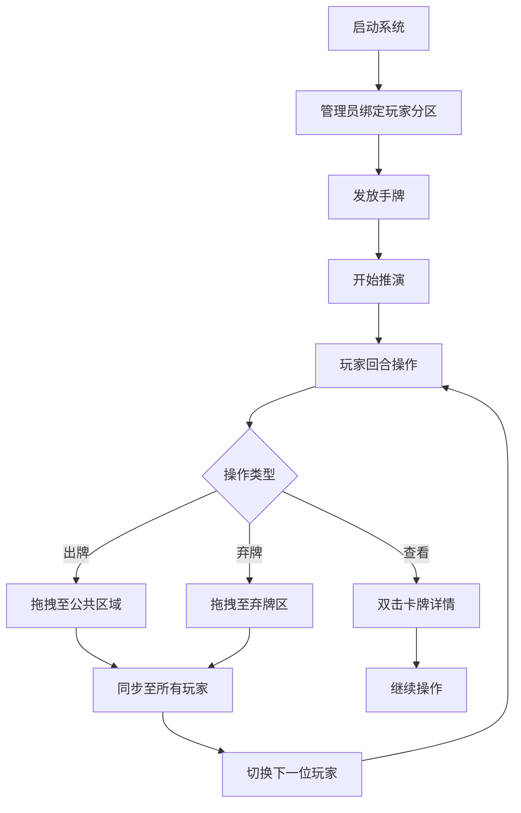

## 1. 产品概述
单触控会议桌数字化卡牌推演系统Demo，基于B/S架构设计，专为65寸以上触控会议桌打造。支持8-12人环绕操作，核心解决多人视角适配问题，提供流畅的卡牌交互体验，5-10分钟即可完成完整演示流程。

产品面向企业会议、教育培训等场景，通过大屏触控交互提升协作效率，预留AI接口便于后续功能扩展。

## 2. 核心功能

### 2.1 用户角色
| 角色 | 注册方式 | 核心权限 |
|------|----------|----------|
| 管理员 | 系统预设 | 绑定玩家分区、发放手牌、控制演示流程 |
| 普通玩家 | 无需注册 | 操作自己分区的卡牌、查看公共区域 |

### 2.2 功能模块
系统包含以下核心页面：
1. **推演主界面**：中心公共区域、个人视角区域、边缘辅助区域
2. **管理员控制台**：玩家分区绑定、手牌发放、流程控制

### 2.3 页面详情
| 页面名称 | 模块名称 | 功能描述 |
|----------|----------|----------|
| 推演主界面 | 中心公共区域 | 显示公共卡牌、回合提示，固定视角确保所有玩家查看一致 |
| 推演主界面 | 个人视角区域 | 8-12个分区，每个分区自动旋转卡牌0-360°确保对应玩家正视时正向 |
| 推演主界面 | 边缘辅助区域 | 显示弃牌堆、操作提示、玩家状态 |
| 推演主界面 | 触控交互模块 | 点击选中卡牌、拖拽出牌/弃牌、双击查看详情，支持多点触控 |
| 推演主界面 | AI功能入口 | 提供"AI生成卡牌"、"AI接管研判"按钮，点击显示功能待上线提示 |
| 管理员控制台 | 玩家管理 | 绑定玩家到指定分区，设置玩家昵称和颜色标识 |
| 管理员控制台 | 卡牌发放 | 为每个玩家发放3-5张手牌，支持随机分配 |
| 管理员控制台 | 流程控制 | 启动推演、切换回合、重置游戏 |

## 3. 核心流程

### 管理员流程
1. 进入管理员控制台
2. 绑定玩家到对应分区（8-12人）
3. 为每个玩家发放手牌（3-5张）
4. 启动推演，系统自动指定首位回合玩家
5. 监控演示过程，必要时进行视角切换

### 玩家流程
1. 查看自己分区的手牌（自动旋转至正向）
2. 点击选中卡牌，拖拽至公共区域出牌
3. 拖拽卡牌至弃牌区弃牌
4. 双击卡牌查看详细信息
5. 观察其他玩家操作和公共区域变化

## 4. 用户界面设计

### 4.1 设计风格
- **主色调**：深蓝色（#1a237e）背景，金色（#ffd700）边框强调
- **按钮样式**：圆角矩形，触控区域放大20%，悬停时有阴影效果
- **字体**：微软雅黑，标题24px，正文18px，确保远距离可读
- **布局风格**：环形分区布局，中心对称，每个玩家分区用不同颜色边框区分
- **图标风格**：扁平化设计，使用卡牌游戏相关图标

### 4.2 页面设计
| 页面名称 | 模块名称 | UI元素 |
|----------|----------|--------|
| 推演主界面 | 中心公共区域 | 圆形布局，直径占屏幕40%，卡牌固定正向显示，金色边框装饰 |
| 推演主界面 | 个人视角区域 | 8-12个扇形分区，每个分区自动计算旋转角度，卡牌根据分区角度旋转 |
| 推演主界面 | 卡牌元素 | 尺寸120x180px，包含名称、类型图标、简短描述，选中时蓝色高亮边框 |
| 推演主界面 | 操作反馈 | 触控震动（设备支持时），操作成功绿色提示，失败红色提示 |
| 管理员控制台 | 控制面板 | 简洁的列表界面，显示玩家状态，提供绑定、发放、控制按钮 |

### 4.3 响应式设计
- **桌面优先**：针对65-86寸触控会议桌优化
- **分辨率适配**：支持1920x1080至3840x2160分辨率
- **触控优化**：所有交互元素触控区域≥44px，支持多点触控
- **性能保证**：60fps流畅运行，卡牌拖拽无卡顿

### 4.4 视角适配算法
- **分区角度计算**：360° ÷ 玩家数量，每个分区中心线角度 = 分区索引 × 角度间隔
- **卡牌旋转规则**：卡牌旋转角度 = 分区中心线角度，确保正对对应玩家
- **坐标转换**：使用极坐标系计算每个分区的精确位置和旋转角度