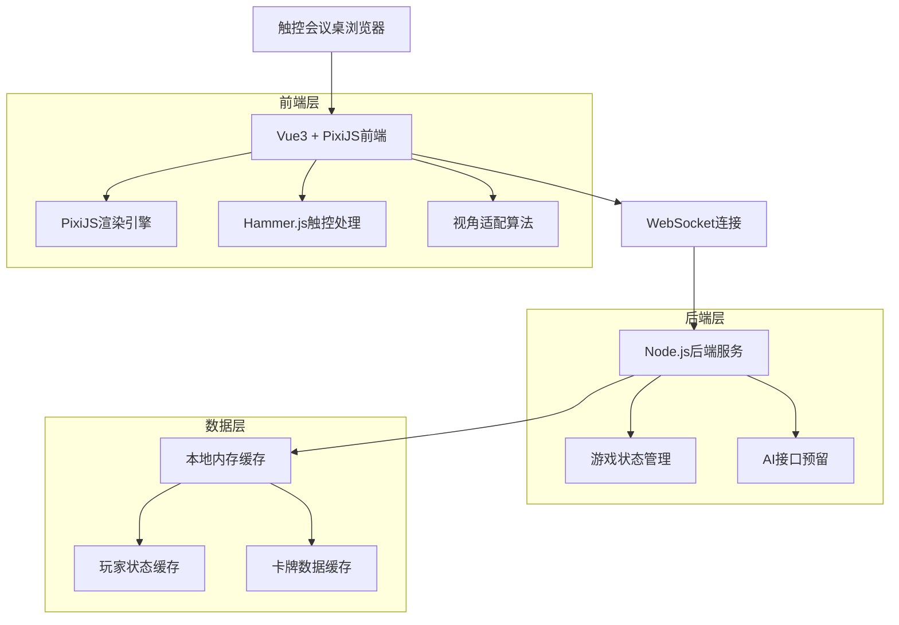
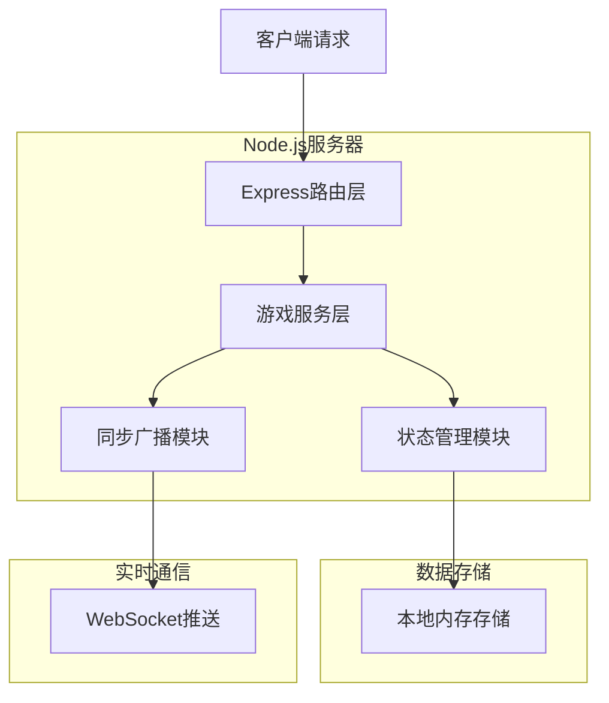

## 1. 架构设计



## 2. 技术栈说明

- **前端框架**: Vue3@3.4 + Vite@5.0
- **渲染引擎**: PixiJS@7.x（2D渲染，支持WebGL）
- **触控处理**: Hammer.js@2.0（多点触控手势识别）
- **状态管理**: Pinia@2.1（Vue状态管理）
- **后端服务**: Node.js@18 + Express@4.18
- **实时通信**: Socket.IO@4.x（WebSocket实时同步）
- **初始化工具**: vite-init

## 3. 路由定义

| 路由 | 用途 |
|------|------|
| / | 推演主界面，显示游戏区域和交互界面 |
| /admin | 管理员控制台，玩家管理和流程控制 |
| /demo | 演示模式，预设数据快速开始 |

## 4. API定义

### 4.1 游戏状态管理
```
POST /api/game/start
```
请求参数：
| 参数名 | 类型 | 必需 | 描述 |
|--------|------|------|------|
| playerCount | number | 是 | 玩家数量（8-12） |
| cardsPerPlayer | number | 是 | 每人手牌数量（3-5） |

响应：
```json
{
  "status": "success",
  "gameId": "game_123",
  "players": [
    {
      "id": "player_1",
      "zone": 0,
      "cards": ["card_1", "card_2", "card_3"]
    }
  ]
}
```

### 4.2 卡牌操作
```
POST /api/card/play
```
请求参数：
| 参数名 | 类型 | 必需 | 描述 |
|--------|------|------|------|
| playerId | string | 是 | 玩家ID |
| cardId | string | 是 | 卡牌ID |
| targetZone | string | 是 | 目标区域（public/discard） |

### 4.3 AI接口预留
```
POST /api/ai/generateCard
```
```
POST /api/ai/takeOver
```
响应统一返回：
```json
{
  "status": "pending",
  "message": "AI功能待上线，Demo暂不支持"
}
```

## 5. 服务器架构



## 6. 数据模型

### 6.1 游戏状态模型
```typescript
interface GameState {
  gameId: string;
  status: 'waiting' | 'playing' | 'ended';
  currentPlayer: number;
  players: Player[];
  publicCards: Card[];
  discardPile: Card[];
}

interface Player {
  id: string;
  name: string;
  zone: number; // 0-11，对应12个分区
  cards: Card[];
  isActive: boolean;
}

interface Card {
  id: string;
  name: string;
  type: 'deduction' | 'prop' | 'ai';
  description: string;
  icon: string;
  rotation: number; // 卡牌旋转角度
}
```

### 6.2 视角适配算法
```typescript
// 计算分区角度
function calculateZoneAngle(zoneIndex: number, totalZones: number): number {
  return (360 / totalZones) * zoneIndex;
}

// 计算卡牌旋转角度
function calculateCardRotation(zoneAngle: number): number {
  // 确保卡牌正向面对对应玩家
  return zoneAngle;
}

// 坐标转换（极坐标转笛卡尔坐标）
function polarToCartesian(
  angle: number, 
  radius: number, 
  centerX: number, 
  centerY: number
): {x: number, y: number} {
  const radian = (angle - 90) * Math.PI / 180;
  return {
    x: centerX + radius * Math.cos(radian),
    y: centerY + radius * Math.sin(radian)
  };
}
```

### 6.3 内存数据结构
```javascript
// 游戏状态存储
const gameStates = new Map();

// 玩家连接映射
const playerConnections = new Map();

// 卡牌模板数据
const cardTemplates = [
  { type: 'deduction', ratio: 0.8, templates: [...] },
  { type: 'prop', ratio: 0.15, templates: [...] },
  { type: 'ai', ratio: 0.05, templates: [...] }
];
```

## 7. 性能优化策略

### 7.1 渲染优化
- **PixiJS缓存**: 预渲染卡牌纹理，减少实时绘制
- **视锥剔除**: 只渲染可见区域的卡牌
- **批量渲染**: 合并相同类型的渲染调用

### 7.2 触控优化
- **事件节流**: 拖拽事件16ms节流，确保60fps
- **预测算法**: 预测拖拽轨迹，提前计算目标位置
- **触摸反馈**: 100ms内响应触控操作

### 7.3 网络优化
- **增量同步**: 只同步变化的状态数据
- **二进制协议**: 使用MessagePack压缩数据
- **本地预测**: 客户端先执行操作，服务器确认后更新