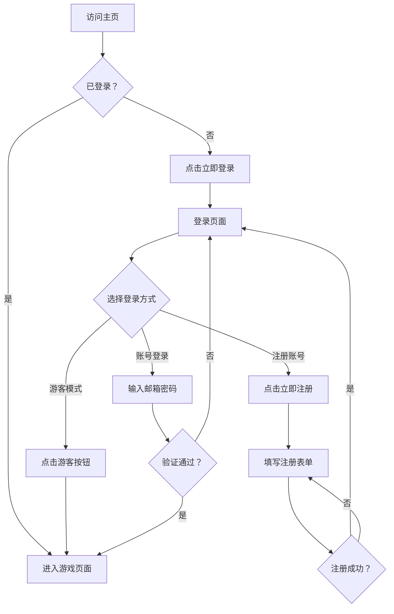

# 登录与注册页面使用指南

## 目录
- [快速开始](#快速开始)
- [登录页面功能](#登录页面功能)
- [注册页面功能](#注册页面功能)
- [页面操作流程](#页面操作流程)
- [常见问题](#常见问题)

---

## 快速开始

### 1. 启动项目

```bash
# 安装依赖（如果还未安装）
npm install

# 启动开发服务器
npm run dev
```

启动后，访问：
- **前端页面**: http://localhost:5174/
- **后端 API**: http://localhost:3001/

### 2. 访问页面

启动成功后，浏览器会自动打开主页。点击 **"立即登录"** 或 **"免费注册"** 按钮即可进入登录/注册页面。

---

## 登录页面功能

### 页面特性
✨ **现代化 UI 设计**
- 渐变背景色（紫红色系）
- 动态浮动粒子效果
- 毛玻璃质感卡片
- 平滑过渡动画

🔐 **完整的表单验证**
- 邮箱格式验证
- 密码必填验证
- 实时错误提示
- 加载状态显示

### 登录方式

#### 方式一：账号密码登录
1. 输入**邮箱地址**
2. 输入**密码**
3. （可选）勾选"记住我"
4. 点击 **"登录"** 按钮

**示例账号**：
- 邮箱：`test@example.com`
- 密码：`Test1234`（需先注册）

#### 方式二：游客模式
- 点击 **"游客"** 按钮
- 无需注册，直接以游客身份进入系统
- 游客账号信息：
  - 用户名：游客
  - 邮箱：guest@example.com

#### 方式三：第三方登录（演示）
- **Google**：预留接口，可后续集成
- **GitHub**：预留接口，可后续集成

### 其他功能

🔄 **切换到注册页面**
- 点击底部的 **"还没有账号？立即注册"** 链接

🔑 **忘记密码**
- 点击 **"忘记密码？"** 链接（当前为演示，暂未实现）

---

## 注册页面功能

### 注册表单字段

| 字段 | 要求 | 说明 |
|------|------|------|
| **用户名** | 必填，至少 3 位 | 用于显示的个人标识 |
| **邮箱地址** | 必填，有效格式 | 用于登录和账号找回 |
| **密码** | 必填，至少 8 位 | 需包含大小写字母和数字 |
| **确认密码** | 必填，与密码一致 | 防止输入错误 |
| **服务条款** | 必选 | 同意用户协议 |

### 密码要求
✅ 密码必须满足以下条件：
- 长度至少 8 位
- 包含至少 1 个大写字母（A-Z）
- 包含至少 1 个小写字母（a-z）
- 包含至少 1 个数字（0-9）

**示例密码**：`Test1234`, `Demo5678`, `MyPass99`

### 注册流程

1. **填写用户名**
   - 输入 3 位以上的用户名
   
2. **填写邮箱**
   - 输入有效的邮箱地址（如：`user@example.com`）

3. **设置密码**
   - 输入符合要求的密码
   - 可点击"👁️"图标显示/隐藏密码

4. **确认密码**
   - 再次输入相同的密码

5. **同意条款**
   - 勾选"我已阅读并同意服务条款和隐私政策"

6. **提交注册**
   - 点击 **"注册"** 按钮
   - 注册成功后会自动跳转到登录页面

### 注册成功后的操作

注册成功后，您可以：
1. 自动跳转到登录页面
2. 使用刚注册的账号登录
3. 登录后进入游戏页面

---

## 页面操作流程

### 完整用户流程



### 详细操作步骤

#### 场景一：新用户注册并登录

1. **访问主页**
   - 打开浏览器，访问 http://localhost:5174/
   - 查看主页介绍

2. **进入注册页面**
   - 点击主页的 **"免费注册"** 按钮
   - 或直接访问 `/register` 路由

3. **填写注册信息**
   ```
   用户名：testuser
   邮箱：test@example.com
   密码：Test1234
   确认密码：Test1234
   ✓ 我已阅读并同意服务条款
   ```

4. **提交注册**
   - 点击 **"注册"** 按钮
   - 等待注册成功提示

5. **自动跳转**
   - 注册成功后自动跳转到登录页面
   - 或手动切换到登录页面

6. **登录账号**
   - 输入邮箱：`test@example.com`
   - 输入密码：`Test1234`
   - 点击 **"登录"** 按钮

7. **进入游戏页面**
   - 登录成功后自动跳转到 `/game`
   - 右上角显示用户信息（头像、用户名、邮箱）

#### 场景二：游客快速体验

1. **访问登录页面**
   - 点击主页的 **"立即登录"** 按钮

2. **选择游客模式**
   - 点击 **"游客"** 按钮

3. **直接进入系统**
   - 无需填写任何信息
   - 自动跳转到游戏页面

#### 场景三：已登录用户访问

1. **登录后**
   - 用户信息保存在 localStorage
   - 刷新页面仍保持登录状态

2. **访问主页**
   - 自动显示 **"开始游戏"** 按钮
   - 不再显示登录/注册按钮

3. **访问登录页**
   - 自动重定向到游戏页面
   - 防止重复登录

---

## 路由说明

### 路由配置

| 路径 | 名称 | 权限 | 说明 |
|------|------|------|------|
| `/` | home | 公开 | 主页，展示项目介绍 |
| `/login` | login | 仅游客 | 登录页面 |
| `/register` | register | 仅游客 | 注册页面 |
| `/game` | game | 需登录 | 游戏主页面 |

### 路由守卫

**自动重定向规则**：

1. **未登录时访问游戏页面**
   ```
   访问 /game → 重定向到 /login
   ```

2. **已登录时访问登录/注册页**
   ```
   访问 /login → 重定向到 /game
   访问 /register → 重定向到 /game
   ```

3. **登录成功后**
   ```
   登录成功 → 跳转到 /game
   ```

4. **注册成功后**
   ```
   注册成功 → 跳转到 /login
   ```

---

## 用户信息管理

### 查看用户信息

登录成功后，在游戏页面的**右上角**可以看到：
- 👤 用户头像
- 📛 用户名
- 📧 邮箱地址
- 🚪 登出按钮

### 修改用户信息

当前版本用户信息存储在 `localStorage` 中：

```javascript
// 查看存储的用户信息
localStorage.getItem('auth_user')

// 查看存储的 Token
localStorage.getItem('auth_token')
```

### 登出操作

1. 点击游戏页面右上角的 **"登出"** 按钮
2. 确认登出提示
3. 自动跳转到登录页面
4. 清除本地存储的用户信息

---

## API 接口说明

### 后端 API 地址

```
基础 URL: http://localhost:3001/api/auth
```

### 接口列表

#### 1. 用户注册
```http
POST /api/auth/register
Content-Type: application/json

{
  "username": "testuser",
  "email": "test@example.com",
  "password": "Test1234"
}
```

**响应示例**：
```json
{
  "message": "注册成功",
  "user": {
    "id": "uuid",
    "username": "testuser",
    "email": "test@example.com",
    "avatar": "https://ui-avatars.com/..."
  }
}
```

#### 2. 用户登录
```http
POST /api/auth/login
Content-Type: application/json

{
  "email": "test@example.com",
  "password": "Test1234"
}
```

**响应示例**：
```json
{
  "message": "登录成功",
  "token": "jwt_token_xxx",
  "user": {
    "id": "uuid",
    "username": "testuser",
    "email": "test@example.com",
    "avatar": "https://ui-avatars.com/..."
  }
}
```

#### 3. 用户登出
```http
POST /api/auth/logout
Authorization: Bearer <token>
```

#### 4. 获取当前用户信息
```http
GET /api/auth/me
Authorization: Bearer <token>
```

#### 5. 刷新 Token
```http
POST /api/auth/refresh
Authorization: Bearer <token>
```

---

## 常见问题

### Q1: 注册时提示"邮箱格式不正确"
**A**: 请确保邮箱包含 `@` 和域名，例如：`user@example.com`

### Q2: 密码验证不通过
**A**: 检查密码是否满足所有要求：
- ✓ 至少 8 位
- ✓ 包含大写字母
- ✓ 包含小写字母
- ✓ 包含数字

### Q3: 登录后刷新页面就退出了
**A**: 检查浏览器是否禁用了 localStorage，或清理了浏览器缓存

### Q4: 提示"网络错误"
**A**: 
1. 确认后端服务器已启动（端口 3001）
2. 检查控制台是否有 API 错误
3. 如果后端未启动，系统会降级使用模拟数据

### Q5: 如何测试登录功能？
**A**: 推荐使用以下方式：
```
方式 1：游客模式（最快）
方式 2：注册测试账号
  邮箱：test@example.com
  密码：Test1234
```

### Q6: 第三方登录无法使用
**A**: Google 和 GitHub 登录当前为演示按钮，需要后续集成 OAuth 认证。

---

## 技术特性

### 前端技术栈
- Vue 3 + TypeScript
- Vue Router（路由管理）
- Pinia（状态管理）
- Tailwind CSS（样式）
- Lucide Icons（图标）

### 后端技术栈
- Express.js
- JWT（身份认证）
- Socket.IO（实时通信）

### 安全特性
- 密码 SHA-256 加密存储
- JWT Token 认证
- 路由守卫保护
- 输入验证

---

## 开发调试技巧

### 1. 查看网络请求
打开浏览器开发者工具 → Network 标签页
- 查看登录/注册 API 请求
- 检查请求参数和响应

### 2. 查看本地存储
打开浏览器开发者工具 → Application → Local Storage
- 查看 `auth_user`: 用户信息
- 查看 `auth_token`: JWT Token

### 3. 调试路由
使用 Vue DevTools 扩展
- 查看当前路由
- 查看路由参数和元信息

### 4. 测试不同场景
```javascript
// 在控制台手动执行
import { useAuthStore } from '@/store/authStore'
const authStore = useAuthStore()

// 查看当前用户
console.log(authStore.user)
console.log(authStore.isAuthenticated)

// 手动登出
authStore.logout()

// 手动登录（模拟）
authStore.loginAsGuest()
```

---

## 下一步

### 功能扩展建议
1. ✅ 集成真实的数据库
2. ✅ 添加邮箱验证功能
3. ✅ 实现密码找回
4. ✅ 完善第三方登录
5. ✅ 添加用户资料编辑
6. ✅ 实现多因素认证

### 性能优化
- 添加请求节流
- 实现 Token 自动刷新
- 优化动画性能
- 添加骨架屏加载

---

## 联系方式

如有问题或建议，请通过以下方式联系：
- 📧 Email: support@example.com
- 💬 Issues: GitHub Issues

---

**最后更新**: 2026-03-10
**版本**: v1.0.0
